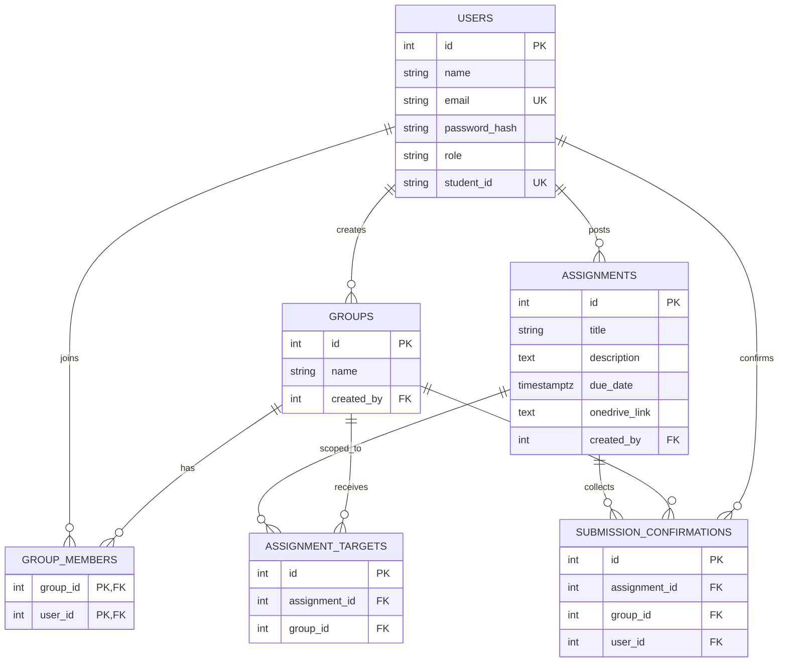

# Joineazy Studio — Student, Group & Assignment Management

Role-based web app for Joineazy Task 1. Students form groups, open professor OneDrive links, and confirm submissions in two steps. Professors publish assignments (to everyone or to chosen groups) and watch group- and student-level progress.

## Architecture

```
Browser (React + Tailwind)
        |  JWT in Authorization header
        v
Express API  ----  PostgreSQL
  /api/auth
  /api/groups
  /api/assignments
  /api/analytics
```

Docker Compose runs three services: `db` (Postgres 16), `backend` (Node), `frontend` (nginx + built React). Nginx proxies `/api` to the backend so the browser uses same-origin requests in production.

Students belong to **at most one group**. Assignment visibility is either all groups or an explicit group list. Each group member confirms a submission independently; group progress is confirmed members / total members.

## Quick start (Docker)

```bash
docker compose up --build
```

- App: http://localhost:5173
- API: http://localhost:4000/api/health

### Demo accounts (seeded on first boot)

| Role | Email | Password |
| --- | --- | --- |
| Admin | professor@joineazy.edu | Admin123! |
| Student | aarav@uni.edu | Student123! |
| Student | diya@uni.edu | Student123! |

Other seeded students: `kabir@uni.edu`, `meera@uni.edu`, `rohan@uni.edu` (same password). Student IDs `STU001`–`STU005`.

## Local development

Requires Node 20+ and PostgreSQL (or just the `db` service).

```bash
docker compose up db -d
cp .env.example backend/.env
cd backend && npm install && npm run dev
cd ../frontend && npm install && npm run dev
```

Frontend Vite proxy forwards `/api` to `http://localhost:4000`.

## API

All JSON. Protected routes: `Authorization: Bearer <token>`.

### Auth

| Method | Path | Who | Body / notes |
| --- | --- | --- | --- |
| POST | `/api/auth/register` | public | `{ name, email, password, studentId }` — always creates a **student** |
| POST | `/api/auth/login` | public | `{ email, password }` → `{ user, token }` |
| GET | `/api/auth/me` | any user | current profile |

### Groups

| Method | Path | Who | Notes |
| --- | --- | --- | --- |
| POST | `/api/groups` | student | `{ name }` — creator is auto-added |
| GET | `/api/groups/mine` | student | `{ group }` or `{ group: null }` |
| GET | `/api/groups` | admin | all groups with members |
| POST | `/api/groups/:id/members` | group creator | `{ email }` or `{ studentId }` |
| DELETE | `/api/groups/:id/members/:userId` | group creator | cannot remove creator |

### Assignments & confirmations

| Method | Path | Who | Notes |
| --- | --- | --- | --- |
| GET | `/api/assignments` | student / admin | students only see targeted work, with group progress |
| GET | `/api/assignments/:id` | student / admin | admin payload includes `groupProgress` |
| POST | `/api/assignments` | admin | `{ title, description, dueDate, onedriveLink, targetAll, groupIds }` |
| PUT | `/api/assignments/:id` | admin | same fields as create |
| POST | `/api/assignments/:id/confirm` | student | **two-step:** `{ step: 2, confirmed: true }` after the UI first prompt |

### Analytics

| Method | Path | Who | Notes |
| --- | --- | --- | --- |
| GET | `/api/analytics/overview` | admin | totals, per-assignment %, group completion, student table |

## Database schema



`assignment_targets.group_id = NULL` means the assignment is visible to every group.

## Design decisions

- **JWT + roles in the token**, with a second check on every mutating route. Admins cannot be self-registered; the seeded professor is the admin path for the demo.
- **One group per student** (unique `group_members.user_id`) keeps assignment targeting and progress math unambiguous.
- **Per-student confirmation** (not a single group checkbox) is how student-wise and group-wise tracking both stay accurate. The two-step UI is required; the API rejects confirmations that skip `{ step: 2, confirmed: true }`.
- **Uploads stay on OneDrive.** This app records confirmation only, matching the brief.
- **Schema + seed on boot** so Docker and local `npm run dev` stay demo-ready without a separate migrate CLI.
- **Frontend split from backend** as required; Tailwind for a compact responsive layout; Recharts for the admin completion chart.

## Repository layout

```
backend/          Express API
frontend/          React + Vite + Tailwind
docker-compose.yml
```

## Interview notes

Be ready to walk through: JWT role guards, targeting (`all` vs group list), two-step confirm, progress = confirmed / members, and why confirmations are stored per student rather than per group.
